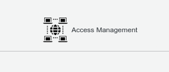
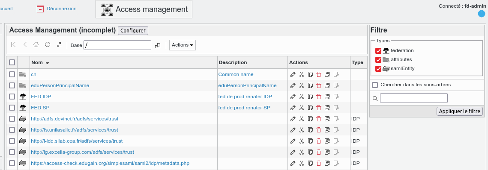
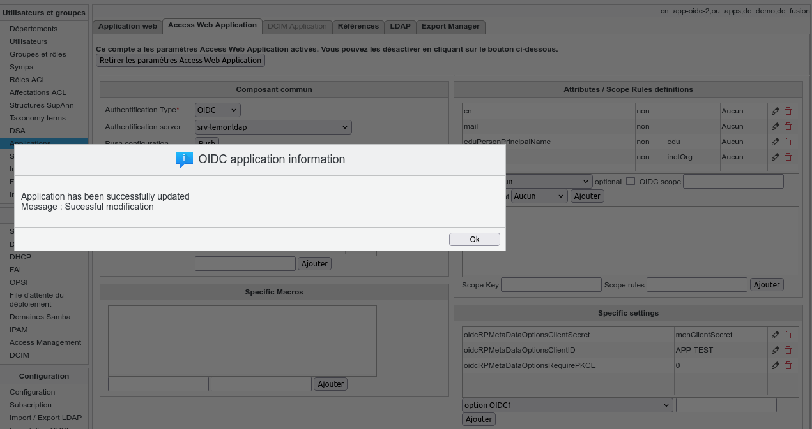
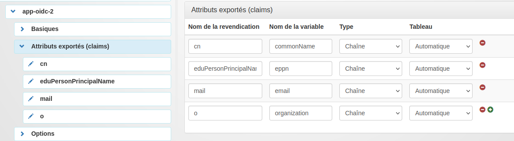

# fusiondirectory-plugins-access

This is a plugin for FusionDirectory for managing configuration of Acces Management system such LemonLDAP::NG

## Why this plugin ?

For example, LemonLDAP::NG have a web interface to setup some application to protect trough CAS / OpendIDC / SAML
But it couldn't be easy to setup application trough models, get some dashboard or delegated to other technicians.

Trough dedicated API, FusionDirectory could setup application remotely on Web access management system.
Currently only LemonLDAP:NG is supported (https://lemonldap-ng.org)

## What does it do ?

You could create attributes configuration (used to setup remote application)
You could create a remote Access Service (only LemonLDAP::NG service supported)
You could define SAML/OIDC/CAS applications and apply to a remote Access Service
You could defined SAML Federation et fetch all metadata in order to overload configuration inside LemonLDAP

## Dependencies
This plugin need taxonomy plugin because all config parameters is stored inside a taxonomy table. It's useful if settings of remote service are modified during software evolution.
This plugin need the restclient.php support and xml support for php.

## Some screenshot and explanation

### Access to the "Access" place
 

### Place where defining
  - SAML Federation  with the url of metadata. When all metadata are loaded, all SAML Entity ID are imported
  - Attributes used by the "Access" system with the current name , the friendly Name, the OID and a small description

### Web access configuration

All web access configuration have a dedicated tab "access".
This tab allow to defined 3 kind of webaccess protocole : 
  - Openidconnect (OIDC)
  - Centralized Access Server (CAS)
  - Simple Assertion Markup Langage (SAML aka shibboleth)
  
Some definitions are common such
  - Attributes lists
  - Macros 
  - Dedicated parameter (définition stored inside a taxonomy table)
  - Web service url protected
 Some definitions are spécific
  - OIDC scope rule
  - SAML : metadata file / or SAML authority
  -
  
Actually , 3 buttons exists
  - push : push configuration to to remote service
  - check : check difference between local and remote application config (not terminated)
  - import : if configuration if different , we could choose to import remote configuration. (not fully implemented yet)
 
 #### when pushing configuration
 

 
 #### Result on LemonLDAP::NG
 

## Todo
  - Create dashboard
  - Web Access application
    - Import remote config
    - Create SAML app configuration from Federated application (like RENATER or EDUGAIN) ( using the overload function of Lemonldap::ng)
    - extract URL of service in order to define the URL protected
  - SAML entity ID
    - import part of XML file
  - Taxonomy
    - create a pre filled taxanomy for LemonLDAP::NG configuration
  

## How to install

`git https://github.com/gallak/fusiondirectory-plugins-access.git`
`mv fusiondirectory-plugins-access access`

> need to rewrite the intallation procedure

### usage

see screenshoot

