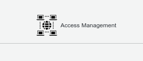
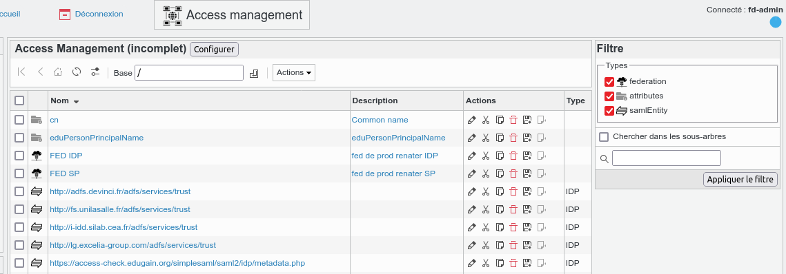
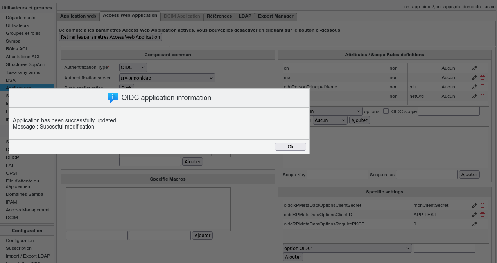
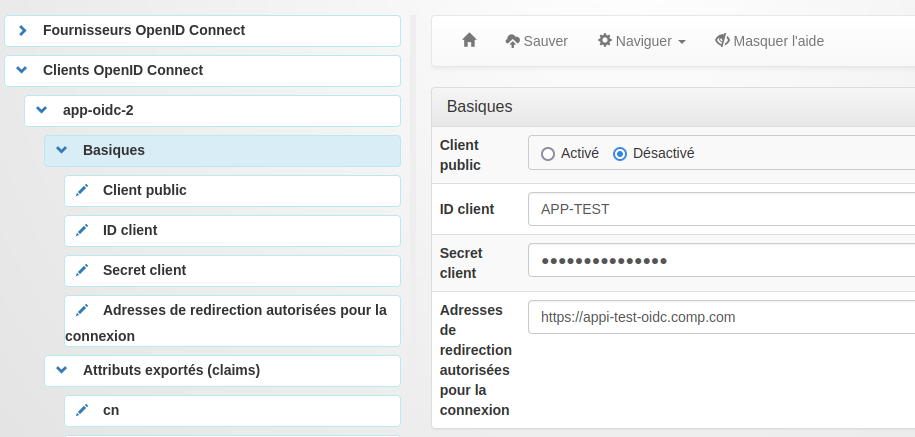
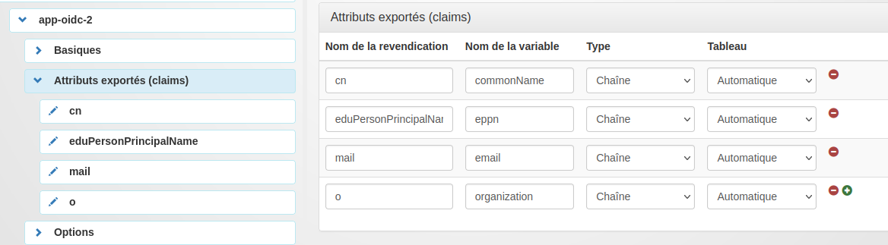

# fusiondirectory-plugins-access

This is a plugin for FusionDirectory for managing configuration of Acces Management system such LemonLDAP::NG

## Why this plugin ?

For example, LemonLDAP::NG have a web interface to setup some application to protect trough CAS / OpendIDC / SAML
But it couldn't be easy to setup application trough models, get some dashboard or delegated to other technicians.

Trough dedicated API, FusionDirectory could setup application remotely on Web access management system.
Currently only LemonLDAP:NG is supported (https://lemonldap-ng.org)

## What does it do ?

You could create attributes configuration (used to setup remote application)
You could create a remote Access Service (only LemonLDAP::NG service supported)
You could define SAML/OIDC/CAS applications and apply to a remote Access Service
You could defined SAML Federation et fetch all metadata in order to overload configuration inside LemonLDAP

## Dependencies
This plugin need the following plugins:
  - systems : because, Access appears as a service associated to one or several servers
  - applications : because each FD applications cold be associated to a access configuration plan to be pusshed to access server

This plugin is compatible for Fusiondirectory version 1.5 ( due to folder organization).
This plugin need the restclient.php support and xml support for php.


## how to install
```
cd /tmp
git clone https://github.com/gallak/fusiondirectory-plugins-access.git
fusiondirectory-plugins-manager --install-plugin /tmp/fusiondirectory-plugins-access
fusiondirectory-configuration-manager --update-locales --update-cache
```

# ROADMAP

 - milestone 1 : V1.0 support of LemonLDAP::NG
   - LEMONLDAP : full support of OIDC / CAS / SAML applications
   - ALL : SSL support
   - ALL : import / export / difference configuration
   
 - milestone 2 : V1.1 SAML Federation  / Portal / dashboard
   - Overload value from Service Provider provided by saml federation
   - Support of portal organisation ( logo / description / access Rule)
   - Dashboard of applications ( how many use OIDC /SAML / CAS and wich attributes)

 - milestone 3 : v1.2 Keycloak and SAML Tools
   - Begining of suppot OIDC app from KeyCloak
   - Support custom SAML Federation
   - Create a custom wayf Portal
   - Provide a way to autogenerate configuration for common SP ( like apache_mod_cas / apache_mod_mellon / apache_mod_oidconnect )


# Some screenshot and explanation

## About attributes definition

Each attributes used inside Access plugin msute declared before.
the name of attribute corresponde to the internal attributes name used inside Access Server (usually, it corresponding to the LDAP field)
For each attribute you MUST declared :
  - name : name used inside the ACCESS system
  - Description : a simple description
  - OID : This is th Object IDentifier used usualauy for SAML ecosystem ( see SAML / OASIS documentation) (for SAML application support)
  - FriendlyNAme: Additionnaly to the OID, a more userfrienly name could be provided (no warranty about usage on Service Provider side) ( for SAML application support)
  - OIDC Claims : OIDC terms name ( for OIDC application support)

Except to CAS protocol, the attributes mapping is done trough the previous name specified. For CAS protocol, there is no official Mappig attribut.

## Access to the "Access" place
 

## Place where defining
  - SAML Federation  with the url of metadata. When all metadata are loaded, all SAML Entity ID are imported
  - Attributes used by the "Access" system with the current name , the friendly Name, the OID and a small description



## Web access configuration

All web access configuration have a dedicated tab "access".
This tab allow to defined 3 kind of webaccess protocole : 
  - Openidconnect (OIDC)
  - Centralized Access Server (CAS)
  - Simple Assertion Markup Langage (SAML aka shibboleth)
  
Some definitions are common such
  - Attributes lists
  - Macros 
  - Dedicated parameter (définition stored inside a taxonomy table)
  - Web service url protected
 Some definitions are spécific
  - OIDC scope rule
  - SAML : metadata file / or SAML authority
  
  
Actually , 3 buttons exists
  - push : push configuration to to remote service
  - check : check difference between local and remote application config
  - import : if configuration if different , we could choose to import remote configuration. (not fully implemented yet)
 
 ## when pushing configuration
 

 
 ## Result on LemonLDAP::NG
 



